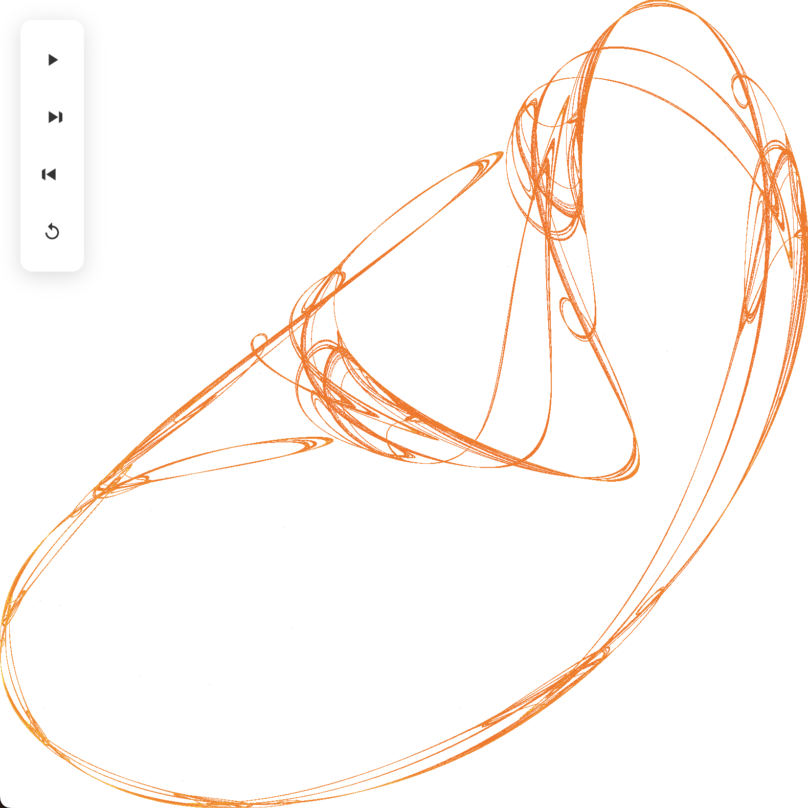

# Lorenz Attractor

This project visualizes the Lorenz attractor using TypeScript and HTML Canvas.



## Prerequisites
- Node.js (v16 or higher recommended)
- yarn

## Installation
1. Clone the repository:
   ```sh
   git clone https://github.com/whiterook6/lorenz-attractor.git
   cd lorenz-attractor
   ```
2. Install dependencies:
   ```sh
   yarn install
   ```

## Build
- **Development build:**
  ```sh
  yarn run build:dev
  ```
- **Production build:**
  ```sh
  yarn run build:prod
  ```
- **Watch (Dev mode):**
  ```sh
  yarn run watch
  ```

## Run
1. Open `index.html` in your browser after building. The output JavaScript is generated in the `output/` folder.

## Project Structure
- `src/` — TypeScript source files
- `build/` — Build scripts
- `output/` — Compiled JavaScript
- `index.html` — Main HTML file

## Development

There's some linting, formatting, and typechecking scripts as well. See the package.json.